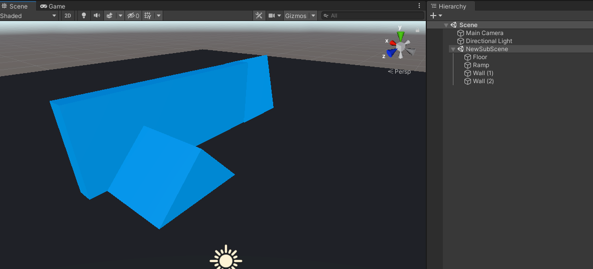
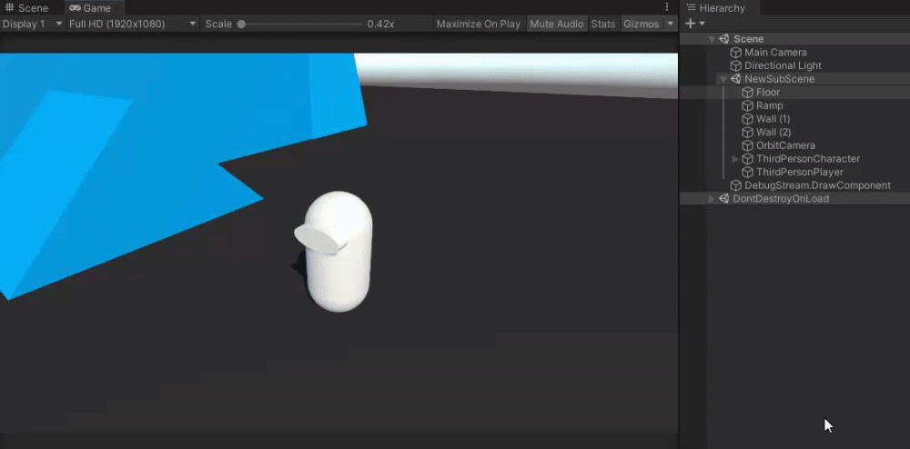

# Tutorial - Standard Character Setup

We will now go through the process of creating a new basic character, using the "Standard Characters" as a starting point. For this tutorial, we'll be using the Third-Person character.

We will first create a basic scene containing a rudimentary environment for our character to be in:
- Create a new scene. This scene should have a camera and a directional light already in it
- Add a Subscene
- Add floors and walls with collisions to this subscene 

Next, we will import the Third-Person standard character into our project:
- Follow the [Third-Person standard character instructions](https://docs.unity3d.com/Packages/com.unity.charactercontroller@latest/index.html?subfolder=/manual/thirdpersonsetup.html) in order to add the character to your subscene.
- Read the [Standard character implementation overview](https://docs.unity3d.com/Packages/com.unity.charactercontroller@latest/index.html?subfolder=/manual/implementationoverview.html), to get a general idea of how this character works.

Once you're done and the character has been added to the subscene, you can try pressing Play, and you should be able to control your new character using mouse and keyboard (WASD)

