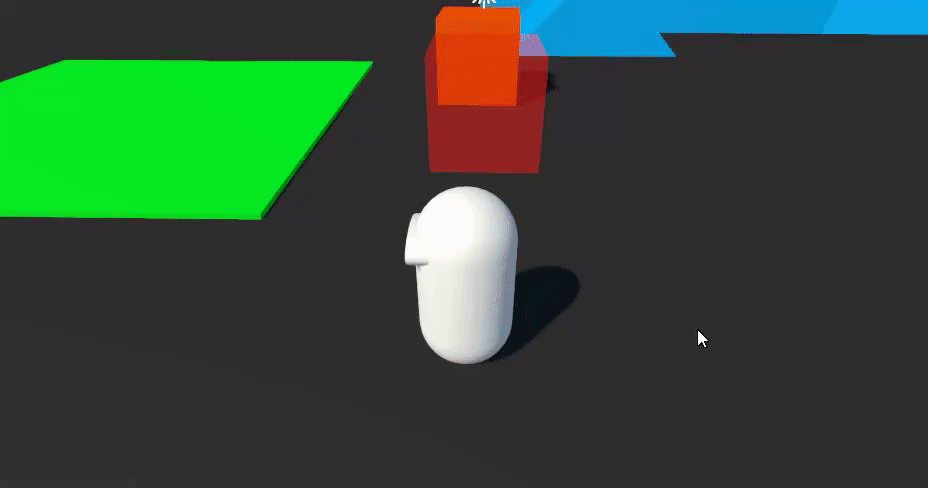

# Tutorial - Friction Surface

Now, we want to be able to create surfaces where the character has a limited movement speed. 

To do this, we will first create a new `CharacterFrictionSurface` component (along with a corresponding authoring component) that will be assignable to certain objects in the world:

```cs
using System;
using Unity.Entities;

[Serializable]
public struct CharacterFrictionSurface : IComponentData
{
    public float VelocityFactor;
}
```

```cs
using UnityEngine;
using Unity.Entities;

public class CharacterFrictionSurfaceAuthoring : MonoBehaviour
{
    public float VelocityFactor;

    class Baker : Baker<CharacterFrictionSurfaceAuthoring>
    {
        public override void Bake(CharacterFrictionSurfaceAuthoring authoring)
        {
            AddComponent(new CharacterFrictionSurface { VelocityFactor = authoring.VelocityFactor });
        }
    }
}
```

At this point, we'd want to modify our `ThirdPersonCharacterAspect.HandleVelocityControl` so that if our `GroundHit.Entity` has a `CharacterFrictionSurface`, then we apply a `VelocityFactor` to our character's desired velocity. However, we can't do this just yet, because we currently have no way to access `CharacterFrictionSurface` components on other entities during our character aspect's updates. This is where `ThirdPersonCharacterUpdateContext` can become useful. `ThirdPersonCharacterUpdateContext` is a struct that gets initialized by character systems, and passed as parameter to the update methods of the character Aspect. This makes it the ideal place to store `ComponentLookup`s, or any singleton data that must be accessed during the character update.

We will therefore add a `ComponentLookup<CharacterFrictionSurface>` in our `ThirdPersonCharacterUpdateContext`, in order to be able to look up these components on other entities (the `ThirdPersonCharacterUpdateContext` struct is located in the same file as our `ThirdPersonCharacterAspect`). The struct should look like this (see comments in code for additional details):

```cs
public struct ThirdPersonCharacterUpdateContext
{
    // Here, you may add additional global data for your character updates, such as ComponentLookups, Singletons, NativeCollections, etc...
    // The data you add here will be accessible in your character updates and all of your character "callbacks".
    [ReadOnly]
    public ComponentLookup<CharacterFrictionSurface> CharacterFrictionSurfaceLookup;

    // This is called by systems that schedule jobs that update the character aspect, in their OnCreate().
    // Here, you can get the component lookups.
    public void OnSystemCreate(ref SystemState state)
    {
        CharacterFrictionSurfaceLookup = state.GetComponentLookup<CharacterFrictionSurface>(true);
    }

    // This is called by systems that schedule jobs that update the character aspect, in their OnUpdate()
    // Here, you can update the component lookups.
    public void OnSystemUpdate(ref SystemState state)
    {
        CharacterFrictionSurfaceLookup.Update(ref state);
    }
}
```

With this, we are ready to access the `CharacterFrictionSurface` component on hit entities in our character updated. We will proceed with modifying `ThirdPersonCharacterAspect.HandleVelocityControl` so that we apply a `VelocityFactor` reduction to our velocity when the `GroundHit.Entity` has a `CharacterFrictionSurface:

```cs
public readonly partial struct ThirdPersonCharacterAspect : IAspect, IKinematicCharacterProcessor<ThirdPersonCharacterUpdateContext>
{
    private void HandleVelocityControl(ref ThirdPersonCharacterUpdateContext context, ref KinematicCharacterUpdateContext baseContext)
    {
        // (...)

        if (characterBody.IsGrounded)
        {
            // Move on ground
            // (...)
            
            // Sprint
            // (...)
            
            // Friction surfaces
            if (context.CharacterFrictionSurfaceLookup.TryGetComponent(characterBody.GroundHit.Entity, out CharacterFrictionSurface frictionSurface))
            {
                targetVelocity *= frictionSurface.VelocityFactor;
            }
            
            CharacterControlUtilities.StandardGroundMove_Interpolated(ref characterBody.RelativeVelocity, targetVelocity, characterComponent.GroundedMovementSharpness, deltaTime, characterBody.GroundingUp, characterBody.GroundHit.Normal);
            
            // Jump
            // (...)
        }
        else
        {
            // (...)
        }
    }

}
```

Finally, you can add a new box object to the Subscene, with a Box collider, and a `CharacterFrictionSurface` component. If you set the `VelocityFactor` to something like `0.2` on that `CharacterFrictionSurfaceAuthoring` and you press Play, you should see your character move much slower on that surface.


